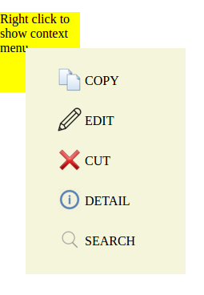

# ng2-context-menu
An Angular 2 reusable component that provides Custom Context Menu support.

### Snapshot


### Prerequisite 
       * Angular-cli: 1.0.0-beta.18 or higher
       * NPM : 4.0.2 or higher
       * Node: v6.9.1 or higher

### Installation
```sh
npm install ng2-context-menu  --save
        or
yarn add ng2-context-menu --save
```
### use

Developers can use this module in angular 2 projects as custom context menu support.
Steps to use :

##### Add `Ng2ContextMenuModule` to the module in which your `component` is declared.

```js
import {Ng2ContextMenuModule} from "ng2-context-menu";

@NgModule({
 ...
  imports: [
    Ng2ContextMenuModule  // like this.
  ],
 ...
})
export class AppModule {
}

```
#### Define your `Context Menu` options in your component `.ts` file
You can define your `Custom Context Menu` options as shown here. Please, read comments carefully.
 ```js
 import {ContextMenuDataService} from "ng2-context-menu";
 ...
 
 // contructor function 
  constructor(private  ContextMenuDataService: ContextMenuDataService) {

  
   /* AddContextMenuOptions 
    * ----------------------
    * This method accepts an array of Context Menu options. 
    * Each option is just an object having two properties -- `iconPath` and `action`.
    * `iconPath` is path to the icon. This icon appears as menu option image/icon.
    * `action` is the just simple text that appears as the name of action.
    * NOTE: You can provide any valid iconPath. But is advisable to keep your images/icons
    * in 'assets' folder.  
    */
    ContextMenuDataService.AddContextMenuOptions([
      {
        iconPath: 'assets/action/copy.png',
        action: 'COPY'
      },
      {
        iconPath: 'assets/action/edit.png',
        action: 'EDIT'
      },
      {
        iconPath: 'assets/action/cut.png',
        action: 'CUT'
      },
      {
        iconPath: 'assets/action/detail.png',
        action: 'DETAIL'
      },
      {
        iconPath: 'assets/action/search.png',
        action: 'SEARCH'
      }
    ]);

   /* OnMenuClick 
    * ----------------------
    * This method listens every click on Context Menu. This method provides action information 
    * that you have done by clickig on a Context Menu option.
    */
    ContextMenuDataService.OnMenuClick().subscribe(actionInfo => {
      console.log(`Action: '${actionInfo.action}' Element: '${actionInfo.targetElementInformation.nodeName}'`);
      console.log(`Information : ${JSON.stringify(actionInfo.information)}`);
      // Write your logic here ...
    });

  }
 
 ```
 *NOTE:* Here, When you click on a Context Menu option, You get action information in `OnMenuClick` function
 as `actionInfo` object. If you log this object, It will have three properties/keys -- `information`, `action`
 and `targetElementInformation`. 
     *`information` represents the information that you pass to the `[context-menu]` directive in your component `template`.      *`action` represents the custom action you clicked like - 'COPY', 'CUT' and 'RENAME' etc.
     *`targetElementInformation` represents the information of the element on which you are performing your action. You can        use `targetElementInformation` key to carry out Html DOM changes for that element.
 
 If You pass invalid parameter to `AddContextMenuOptions`. You will get an error --
 ```text
 Error: Invalid parameters is passed to "AddContextMenuOptions". Goto docs: ...
 ```
 
##### Add `[context-menu]` directive to the element on which you want to open context menu in your component `template`. 

```html
<!-- You can apply [context-menu] directive on any valid HTML 5 element -->
<div [context-menu]="{option: 1}"> Right Click Me To Open Context Menu </div>
<p [context-menu]="'This is a p tag.'"> Right Click Me To Open Context Menu </p>
<p [context-menu]> Right Click Me To Open Context Menu </p>
 ```
Here, You can provide any type of information to `[context-menu]`. When, you will click a Context Menu, You can get this     information. 

##### Add `<ng2-context-menu></ng2-context-menu>` selector in your `template` file. 

```html
<!-- You can apply [context-menu] directive on any valid HTML 5 element -->
<div [context-menu]="{option: 1}"> Right Click Me To Open Context Menu </div>
<p [context-menu]="'This is a p tag.'"> Right Click Me To Open Context Menu </p>
<p [context-menu]> Right Click Me To Open Context Menu </p>

<ng2-context-menu></ng2-context-menu>
 ```
 
##### Add the following css to your component `.css` file. 
```css
:host >>> .__context-menu__ {
  display: none;
  min-height: 200px;
  width: 200px;
  background-color: beige;
  z-index: 1;
  position: fixed;
}

:host >>> .__context-menu-option {
  display: inline-block;
  vertical-align: middle;
}

:host >>> img {
  height: 30px;
  width: 30px;
}

:host >>> .__context-menu-option p {
  text-align: center;
  color: black;
  font-size: inherit;
  font-weight: 400;
  position: absolute;
  margin-left: 30px;
  width: 200px;
  margin-right: 20px;
  float: right;
}

:host >>> .__context-menu__ ul {
  list-style-type: none;
}

:host >>> .__context-menu__ ul li span {
  margin-left: 0px;
}

```
You can customize this css according to your need.

###### Report issues [here](https://github.com/sauravgaursmith/ng2-context-menu/issues)
###### You can sent your comments, queries or suggestions at `js.tech.feedback@gmail.com`

### License

[MIT](LICENSE)
